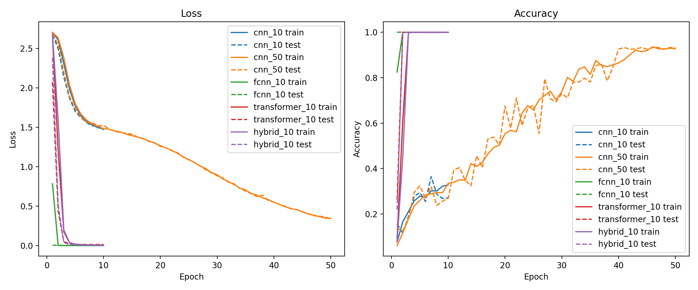
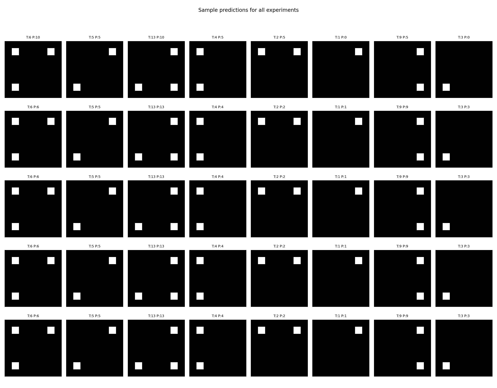
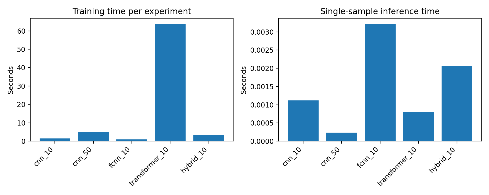

<p align="center">
  
</p>

# CNNs vs Transformers on Synthetic Corner Patterns

This repo contains a small, fully reproducible experiment comparing different vision architectures on a toy classification task where labels depend on absolute pixel locations and their combinations.

## Running

```bash
python main.py
```

## Why

The purpose of this experiment is to isolate and demonstrate how different vision architectures treat absolute position, and why Transformers often outperform basic CNNs on tasks that require global, position-aware reasoning. In a pure convolutional network with global average pooling, spatial information is largely lost due to the **translation-invariant** nature of convolutional filters, making it hard for the model to correctly classify patterns whose labels depend on exact pixel coordinates. Transformers, by contrast, incorporate **positional embeddings** from the start, and attention provides a global receptive field, allowing them to detect and combine spatially distant features with ease. This experiment shows that even extremely simple position-dependent patterns become trivial for Transformers but challenging for a CNN unless the CNN is modified. Importantly, the limitation is not fundamental: CNNs can match Transformer performance when augmented with fully connected layers, coord-conv channels, learned positional maps, or hybrid convolution-transformer stems.

## Task

We use binary images with up to four "corner dots":

- The image is white everywhere (all zeros).
- There are 1 to 4 black pixels placed at the four corners: top-left, top-right, bottom-left, bottom-right.
- Each non-empty subset of corners is a separate class.
- This gives $(2^4 - 1 = 15)$ classes.

The label is essentially a 4-bit mask indicating which corners are active.

The default image size is 16x16 (`IMG_SIZE` in `vars.py`), but you can increase it (e.g. $32\times32$) to see how training and inference times scale. The hybrid model with a convolutional stem is particularly useful at larger resolutions.

<p align="center">
  
</p>

## Models

We train five configurations:

1. `cnn_10` – `SimpleCNNGAP`  
   Simple CNN with global average pooling, 10 epochs. $\text{Conv} \to \text{ReLU} \to \text{Conv} \to \text{ReLU} \to \text{GlobalAvgPool} \to \text{Linear}$ destroys almost all spatial information.

2. `cnn_50` – `SimpleCNNGAP`  
   Same architecture, 50 epochs. Eventually reaches $\approx 92%$ (not $100%$ !) accuracy by exploiting boundary artifacts and subtle positional cues.

3. `fcnn_10` – `SimpleCNNFC`  
   CNN with a fully connected head that sees all spatial positions. Has explicit access to absolute location, so it converges very quickly.

4. `transformer_10` – `SimpleTransformerClassifier`  
   Transformer encoder on flattened pixels with learned positional embeddings.

5. `hybrid_10` – `HybridConvTransformer`  
   Convolutional stem (stride-2 downsamples, reducing resolution by 4x) followed by a transformer encoder on patch tokens. This is closer to typical hybrid vision backbones and scales better to larger images than a pure transformer on raw pixels.

All hyperparameters are defined in `vars.py`.

## Results

The fully connected CNN (`fcnn_10`) solves the task almost instantly, reaching **100% accuracy by epoch 2** because it has direct access to absolute pixel locations.  
Both transformer models (`transformer_10`, `hybrid_10`) also reach **100% accuracy by epochs 4–5**, thanks to positional embeddings and global attention.

In contrast, the simple CNN with global average pooling (`cnn_10`) reaches only **28%** in 10 epochs and only **~94%** after 50 epochs.  
Because global pooling removes most spatial information, it must rely on weak boundary artifacts to infer position—making learning slow and incomplete.

## Runtimes

CNNs are fastest at both training and inference: convolutions and fully connected layers have highly optimized kernels and minimal overhead.  
Transformers are slower because multi-head attention, layer norms, and QKV projections introduce significant fixed overhead—especially for batch size 1.

The hybrid model is the slowest per sample, combining both CNN and transformer costs. It becomes beneficial only at larger image sizes (where sequence length dominates).

<p align="center">
  
</p>
